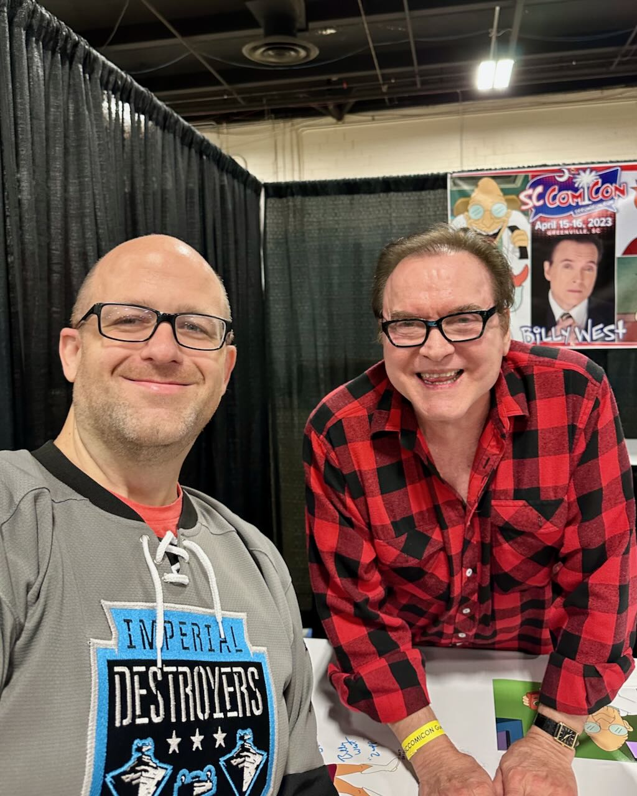
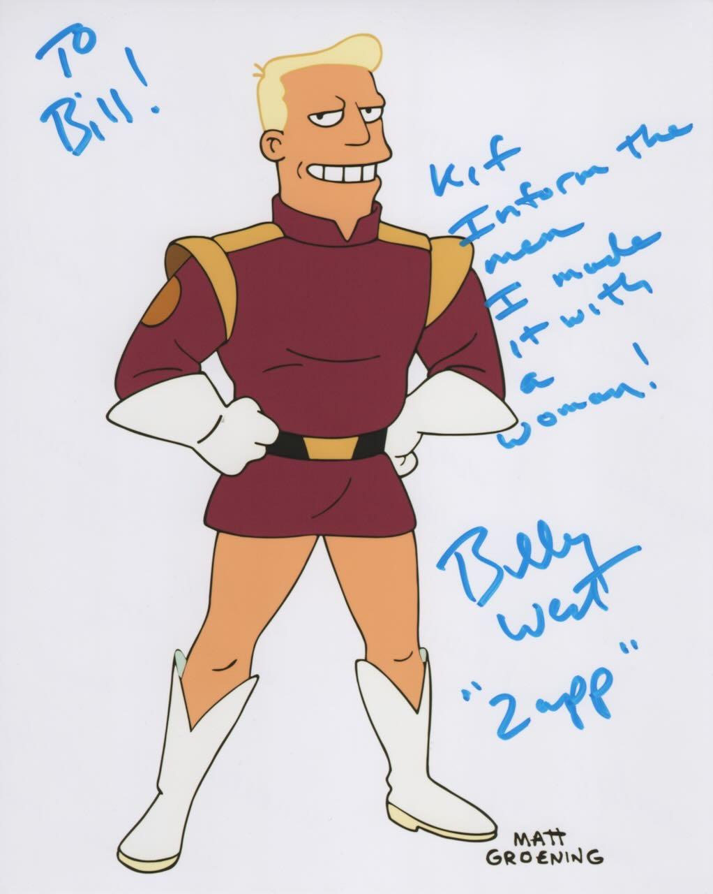
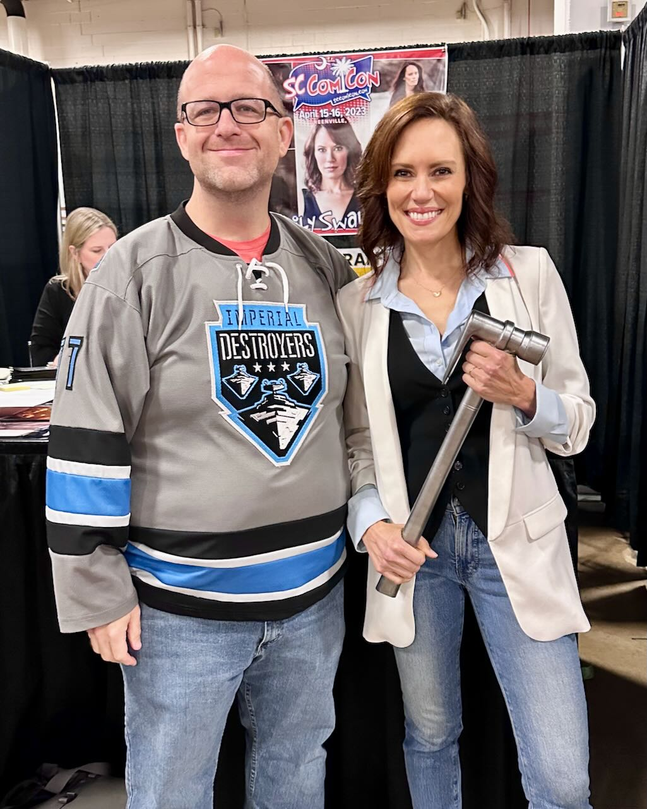
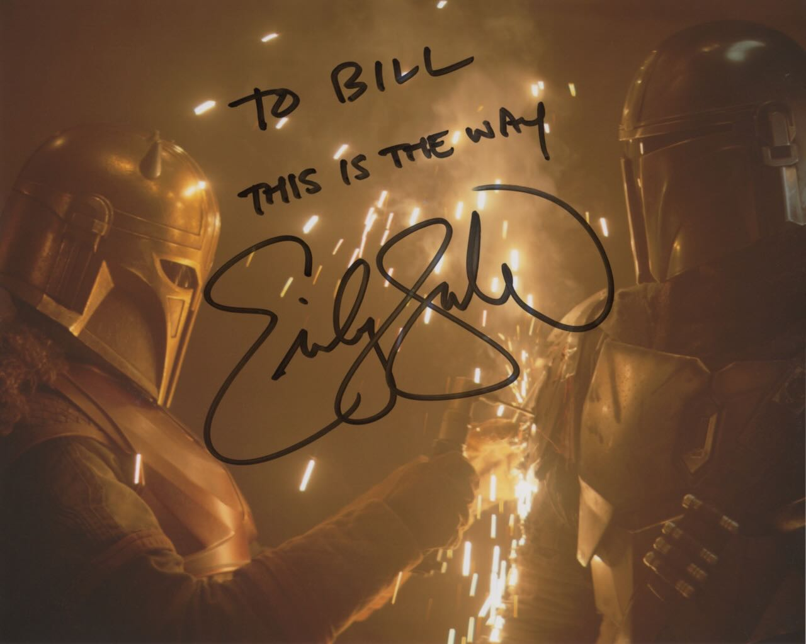

I had planned to attend [GalaxyCon Richmond](https://galaxycon.com/pages/richmond) in March 2023, but unfortunately a case of COVID derailed that trip. So, I was looking for alternatives after I got better and stumbled across [SC Comicon](https://www.sccomicon.com) in Greenville, SC. 

I tend to look for a few things in a convention:‌

* Guests of interest (movie/tv actors, voice actors, artists, etc.)
* Panels & workshops
* Cosplay – Higher quality costuming skill or fun/entertaining takes on characters is what I’d be looking for here
* Concerts
* Gaming or Social – I always intend to do more gaming and then usually don’t and finding/meeting people to hangout with at a con is complicated/stressful for this introvert since people I know typically aren’t as interested in going.

SC Comicon really only offered one of those. There was definitely cosplay, but much of it was anime that I’m not familiar with, so it worked less for me. It is very small in comparison to something like DragonCon (5 total panels vs. literally hundreds), but they had 3 guests that I hadn’t seen previously and wanted to:

* [Emily Swallow](https://www.imdb.com/name/nm2646861/) (The Armorer from The Mandalorian)
* [Billy West](https://www.imdb.com/name/nm0921942/) (Voice actor mostly known to me through Futurama)
* [Kevin Eastman](https://en.wikipedia.org/wiki/Kevin_Eastman) (Comic artists and co-creator of Teenage Mutant Ninja Turtles)

Luckily, it was an easy drive away and the hotel was affordable, so bought a 2 day pass for the weekend & pre-purchased a selfie/autograph with Swallow & West. I got there on Saturday, April 15th, just a bit before 1 pm and was able to quickly make my way inside. The con was in a single large convention space with no separate rooms. Basically, guests to the left, panels to the right and merchants/artists in between. The guests I cared about all seemed to have decently long lines. I waited about 1.5 hours to see Emily Swallow and that was due to a longer line & the fact that she was taking some time to chat with each person (a plus in my opinion). She was very kind and friendly. I got the autograph and then took a photo with her.

Next up, I met Billy West. His line was a bit shorter, but still took about 30 – 45 minutes to get through. He was also willing to take time and speak with each person. I ended up paying a bit extra to get a video with some of his famous phrases from Futurama.

https://www.youtube.com/watch?v=JLkF9EjZv_o

Photo and Autgraph of Billy West

Photo and Autograph of Emily Swallow

Finally, I went to get in line to meet Kevin Eastman, but sadly it was capped, so I bought one of his posters, did a bit of browsing of merch and returned on Sunday to meet him. The poster was already signed, but as I get older, I don’t want to buy merch as much as to obtain memories, so a signed item means nothing if I didn’t get to meet the person. Luckily, I got in his line and got the chance to meet him. He does signings, but also offers a “remark” which is often a little turtle head sketch, so I went with that to personalize the poster a bit. I also tried to buy one of the enamel pins he was selling, but they ended up giving it to me for free. Pictures of both below from where they’re on display in my office.

Finally, here’s a taste of some of the cosplay & miscellanea I saw and thought was worth photographing…

All in all, I really enjoyed myself and got to meet some great people whose work I love. It was largely just a relaxing weekend outside of the standing in line, but that’s kind of what I was wanting 😃