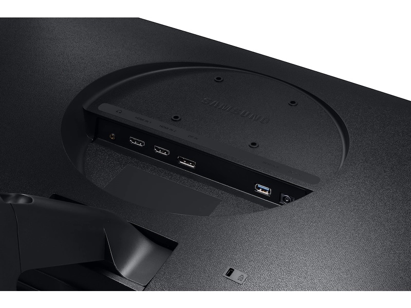
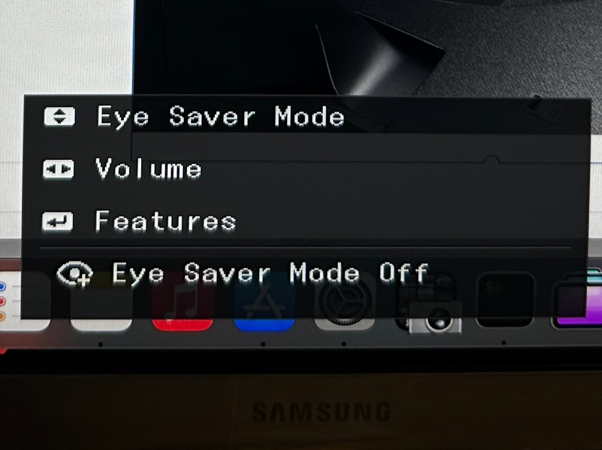

Model: [LU28R550UQNXZA](https://www.samsung.com/us/computing/monitors/uhd-and-wqhd/28-ur50-uhd-monitor-lu28r550uqnxza/)

I have been using a 43″ 4k TV as a monitor for my M1 MacBook Air in clamshell mode for quite some time. However, it has less than great colors as the angles don’t serve it well when viewed in close proximity (like while sitting at a desk). I wanted something that would be a bit crisper with text display, generally consistent color and obviously a bit smaller for better ergonomics.

I’m not getting rid of the TV from my office, but instead it is shifting to my 9-5 work display as it’s an improvement over the 2 x 21″ old Acer FHD displays that I had been using that seem to have even worse viewing at an angle.

In looking at options, I hadn’t found much that worked and I was about to give up & buy an [Apple Studio Display](https://www.apple.com/studio-display/), but this wasn’t my first choice. While it is very attractive and has a crisp/consistent display of text and colors, in my opinion it is absurdly expensive for a 5k display. The engineering choices that we made resulted in a product that is basically old monitor tech bolted to an iPhone. For the price, I’d really expect one or two of the following:

* 30 inch screen
* MUCH better quality camera for the intended use case (CenterStage is only mildly interesting here)
* HDR (wanted for photo and video viewing/editing)

Unfortunately, I think we’ll eventually get that at a further inflated “pro” cost.

Regardless of future changes, it is more than I wanted to spend for what is currently provided. Many of the monitors that I thought might work, fell short somewhere in a glaringly bad way, such as flickering/not waking from sleep properly on DisplayPort or some such. In the end, I decided to try a cheaper monitor as a usable solution now, that I could roll into my 9-5 work setup in the future when I got something better. For this I found the Samsung 28″ ViewFinity UR55 display. It is not without it’s faults, but for $279.99 at [BestBuy](https://www.bestbuy.com/site/samsung-28-viewfinity-uhd-ips-amd-freesync-with-hdr-monitor-black/6386391.p?skuId=6386391), it seems to fit the bill.

**Pros:**

* Attractive (enough) from the front. Minimal bezel (except chin with branding)
* Cheap
* Connectivity (1 DisplayPort, 2 HDMI, audio out, but no speakers)
* Fast enough display power up:
  * 3 seconds – DisplayPort
  * 6 seconds – HDMI
* [Data Display Channel](https://en.wikipedia.org/wiki/Display_Data_Channel) (DDC) support (usable via [DisplayBuddy](https://displaybuddy.app)/[BetterDisplay](https://betterdisplay.pro/))

**Cons:**

* 4k is NOT a proper Retina display at 28″ inches. I’m not sure my eyes could tell unless I see them next to each other, but still…
* Plastic/Cheap feeling, but I don’t touch the display that much
* Bad VESA mounting (see below)
* Brief on-screen display when screen turns on or input is changed (see below)

As far as the VESA issues, this was a big deal to me as I dislike my monitor sitting on the desk. It feels MUCH more secure and more aesthetic to me when on an adjustable arm. Also the included stand allows for front/back tilt, but no height adjustment. Given that, you can see here that they chose to inset the mount points which means almost no VESA plate will fit. My solution was to buy a pack of 16mm M4 machine screws from [Lowe’s](https://www.lowes.com/pd/Hillman-4mm-0-7-x-16mm-Phillips-Drive-Machine-Screws-12-Count/999994930) and a set of M4 black ABS spacers on [Amazon](https://www.amazon.com/dp/B0BL6KGFBG). I laid the monitor on a town on my sofa and placed a spacer over each hole and carefully set the plate on top for attaching (somewhat difficult as the arm doesn’t have a detachable VESA plate). I used the 16mm screw, 5mm spacers and the 1-2 mm plate, so I had 9-10mm of mechanical connection between the arm to the display when seems to be good enough.

The on-screen display looks like this:

Like most multi-input monitors, there is a brief popup in the upper-left saying which import is being used. That doesn’t bother me in the least, but Samsung also pops up the above OSD. It occurs at ~2 sec after the screen becomes active and remains on the display for ~4 sec. I find it annoying, but an acceptable tradeoff given the low cost of the display. Others may be more bothered than I am, but Samsung should **absolutely** make this configurable or get rid of it altogether.

On the whole, I’m content with my purchase. I wouldn’t rave about this monitor, but it’s better than what I was using and affordable. I’d probably rate it a 3.5/5, but I think that’s about the top end for most consumer displays as so few are really “good”.